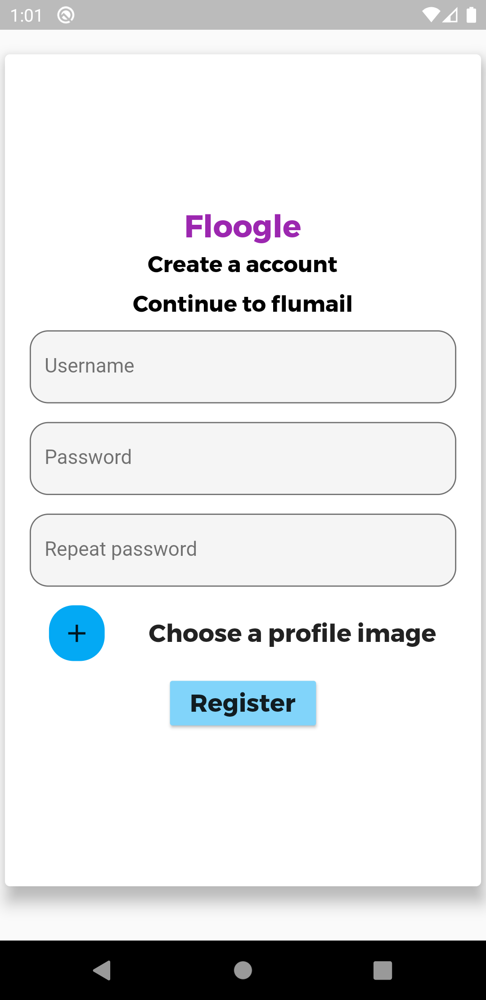
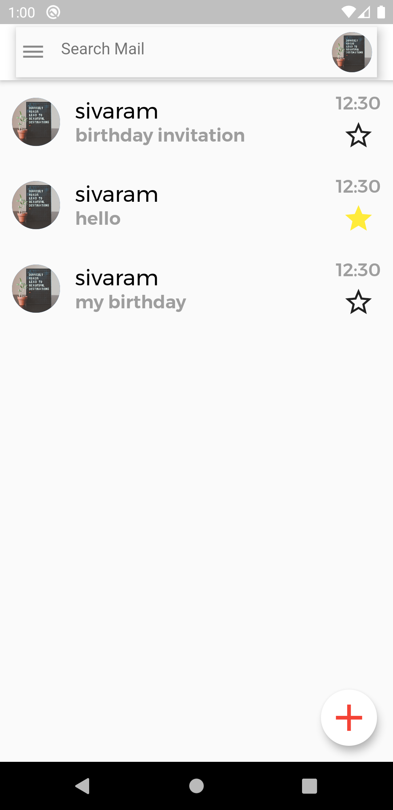
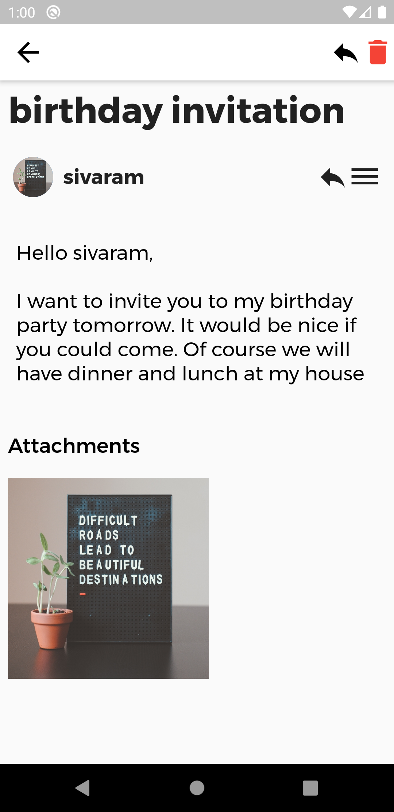
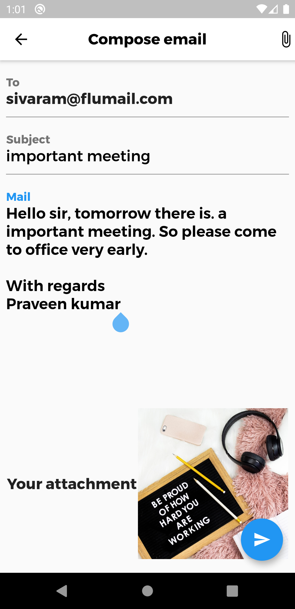

# flumail

A full gmail clone app with flutter and firebase as backend

## Features

* Users can authenticate
* Users have a inbox where they recieve mails
* Users can send a mail
* Users can star , delete and view a mail
* Users can search for a mail
* Users have a mail extension -- @flumail.com
* Everything is realtime with streambuilder

## Screenshots
  
  
